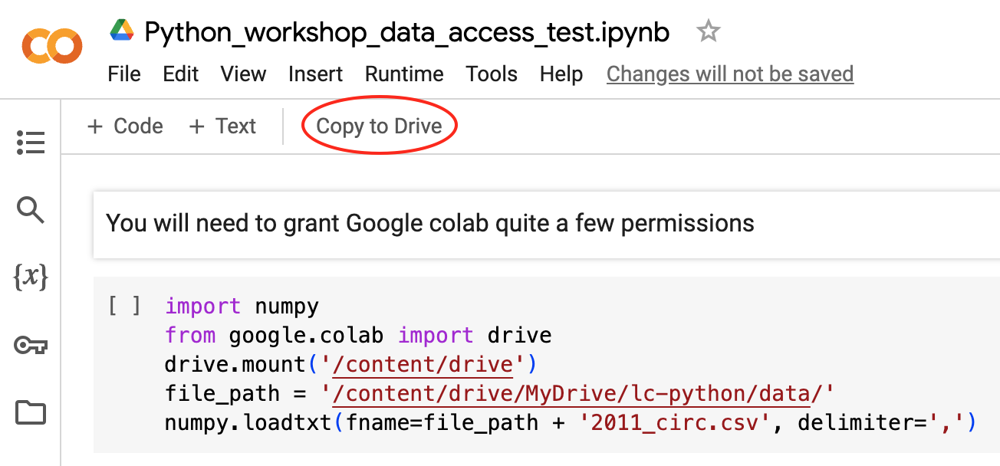
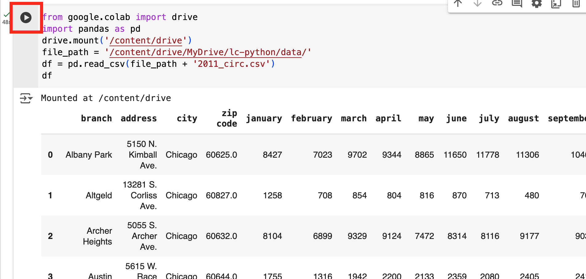
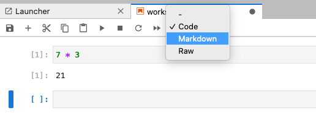

::::::::::::::::::::::::::::::::::::::: objectives

- Learners are aware of applications for Python their work environments.
- Learners can access Google Colab and work in a Colab Notebook.
- Learners are able to navigate the Colab notebook interface.
- Learners are able to write and run Python cells in a notebook.
- Learners are able to save their code as an iPython notebook (.ipynb file).

::::::::::::::::::::::::::::::::::::::::::::::::::

:::::::::::::::::::::::::::::::::::::::: questions

- How do I use Jupyter Notebook?
- How can I run Python code in Google Colab's Jupyter Notebook?

::::::::::::::::::::::::::::::::::::::::::::::::::

:::::::::::::::::::::::::::::::::::::::::: spoiler

## Before we begin

### Open the collaborative doc for our workshop https://broad.io/cb-python-20240927  
You'll find all the links listed below in the collaborative doc.

If you haven't completed your workshop setup please visit https://broad.io/cb-python-setup

##### If you need help with setup, please put the <span style="color:fuchsia">pink post-it</span> on your computer and a TA will come help you.

If you've created your colab account, downloaded the workshop data files,  uploaded it to your colab account's google drive AND successfully run the access test, please put the <span style="color:lime">green post-it</span> on your computer to indicate your setup is complete.

To run the access test, visit https://broad.io/cb-python-access-test, 1. click "Copy to Drive" and, in YOUR COPY of `Python_workshop_data_access_test.ipynb` 2. click the ▶️ symbol on the left hand side of the cell.
{alt='Click the ▶️ symbol'}

This is what success looks like:
{alt=''}

Feel free to browse today's lesson content https:/broad.io/cb-python-20240927-lesson
{alt='Workshop collaborative doc'}

::::::::::::::::::::::::::::::::::::::::::


## Why Python?

Python is a popular programming language for tasks such as data collection, cleaning, and analysis. Python can help you to create reproducible workflows to accomplish repetitive tasks more efficiently. 

This lesson works with a series of CSV files of circulation data from the Chicago Public Library system to demonstrate how to use Python to clean, analyze, and visualize usage data that spans over the course of multiple years. 


## Use Jupyter Notebook to edit and run Python code.
  
If you haven't already done so, see [the setup instructions](../learners/setup.md) for details on preparing to use Google Colab for this workshop. The setup instructions also walk you through the steps you should follow to create an `lc-python` folder in your home directory, to download and unzip the dataset we'll be working with inside of that directory and then upload it to Google Drive so it will be accessible to Google Colab. 

### Getting started with Jupyter Notebook
To run Python, we are going to use Jupyter Notebooks via [Google Colab][https://colab.google/]. Jupyter notebooks are common tools for data science and visualization, and serve as a convenient environment for running Python code interactively where we can view and share the results of our Python code.

:::::::::::::::::::::::::::::::::::::::::  callout
### Alternatives to Juypter
There are other ways of editing, managing, and running Python code. Software developers often use an integrated development environment (IDE) like [PyCharm](https://www.jetbrains.com/pycharm/), [Spyder][spyder] or [Visual Studio Code (VS Code)](https://code.visualstudio.com/), to create and edit Python scripts. Others use text editors like Vim or Emacs to hand-code Python. After editing and saving Python scripts you can execute those programs within an IDE or directly on the command line. 
::::::::::::::::::::::::::::::::::::::::::::::::::

Jupyter notebooks let us execute and view the results of our Python code immediately within the notebook. JupyterLab has several other handy features:

- You can easily type, edit, and copy and paste blocks of code.
- It allows you to annotate your code with links, different sized text, bullets, etc.
  to make it more accessible to you and your collaborators.
- It allows you to display figures next to the code 
  to better explore your data and visualize the results of your analysis.
- Each notebook contains one or more cells that contain code, text, or images.

## Google colab

Google colab is a web-based computational notebook hosted in the cloud by Google.
Much like a lab notebook where a wet-lab experimentalist might have both the 
experimental protocol and notes on the specific experiment, a Jupyter notebook
allows you to have code and notes in the same notebook.

Visit https://colab.research.google.com/ and click on `Examples` or, if you're already in colab, `File -> Open notebook`. Then in the resulting window, click on `Examples`.

Google offers many example notebooks:    

{alt='Partial listing of example notebooks offered by Google colab'}  

Google offers a basic colab experience for free. Hosted runtime machines consume computing resources which will be [shut down](https://research.google.com/colaboratory/faq.html#resource-limits) if you're not active in the notebook. If you see an "Are you still there?" window during this workshop, complete the prompt so your colab notebooks stays active. 

<div>

</div>

If you see `Connect` or `Reconnect`, you've been disconnected from a hosted runtime and you'll need to reconnect. Any work you did in the notebook is likely to be stale and you'll need to `Runtime -> Run all` (Ctrl+F9). 


### Creating a Juypter Notebook

You can create a Jupyter Notebook in Google Colab using your preferred web browser by visitng https://colab.research.google.com/notebooks. In the Open Notebook window, click "New notebook".

When you first open a colab notebook, it may not be ready to execute code. Click on `Connect` (circled in figure) to connect to a hosted runtime. When you see a green checkmark, you're all set to run code in your notebook.  

{alt='View of newly created notebook'}  


Right-click on `Untitled.ipynb` and edit the name of your notebook. Let's call the notebook file, `workshop.ipynb`.


:::::::::::::::::::::::::::::::::::::::::  callout

## Google Colab? What about JupyterLab? Python notebooks? IPython? Quarto?

JupyterLab is the [next stage in the evolution of the Jupyter Notebook](https://jupyterlab.readthedocs.io/en/stable/getting_started/overview.html#overview).
If you have prior experience working with Jupyter notebooks, then you will have a good idea of how to work with JupyterLab. Jupyter was created as a spinoff of IPython in 2014, and includes interactive computing support for languages other than just Python, including R and Julia. While you'll still see some references to Python and IPython notebooks, IPython notebooks are officially deprecated in favor of Jupyter notebooks.

[Quarto](https://quarto.org/) also supports Jupyter Notebooks and enables easy generation of technical documents, presentations, dashboards, websites, blogs and books.

We chose Google Colab as an installation-free way for everyone to access the same coding environment. Information on options to run Python on your laptop can be found in the [Colab Alternatives](../learners/setup.md) section under the setup instructions.

::::::::::::::::::::::::::::::::::::::::::::::::::

Let's run some Python code using Google Colab.

### Running Python code 

Jupyter allows you to add code and formatted text in different types of blocks called cells. By default, each new cell in a Jupyter Notebook will be a "code cell" that allows you to input and run Python code. Let's start by having Python do some arithmetic for us. 

In the first cell type 7 * 3, and then press the <kbd>Shift</kbd>\+<kbd>Return</kbd> keys together to execute the contents of the cell. (You can also run a cell by making sure your cursor is in the cell and choosing `Run > Run Selected Cells` or selecting the "Play" icon (the sideways triangle) at the top of the noteboook.)

```python
7 * 3
```

You should see the output appear immediately below the cell, and Jupyter will also create a new code cell for you. 

```python
21
```

If you move your cursor back to the first cell, just after the `7 * 3` code, and hit the <kbd>Return</kbd> key (without shift), you should see a new line in the cell where you can add more Python code. Let's add another calculation to the same cell:

```python
7 * 3
2 +1
```

While Python runs both calculations Juypter will only display the output from the last line of code in a specific cell, unless you tell it to do otherwise.

```python
3
```

### Editing the notebook

You can use the icons in your notebook to edit the cells in your Notebook:

- The `+ Code` and `+ Text` icons adds a new cell below the selected cell.
- Delete the current cell by clicking the trash icon in the floating icon bar above the right hand side of the current cell. 

You can move cells around in your notebook by using the arrow icons in the floating icon bar above the right hand side of the current cell.

:::::::::::::::::::::::::::::::::::::::::: spoiler

## Note on keyboard shortcuts for Mac

In colab, Macs can use Ctrl+F9 OR ⌘+F9. In other Jupyter notebook environments, Ctrl+F9 may not be an option for Mac. For the rest of this workshop, we'll use indicate Ctrl+\<keystroke\> for simplicity. Mac users should keep in mind that using Command (⌘) in lieu of Ctrl is an option. 
::::::::::::::::::::::::::::::::::::::::::::::::::

:::::::::::::::::::::::::::::::::::::::::  callout
### Markdown
::::::::::::::::::::::::::::::::::::: instructor

Instructors: Since the lesson is focused on Python we don't include any Markdown examples here. If you want to teach Markdown, note that it will slow down the lesson.

:::::::::::::::::::::::::::::::::::::::::::::::::

You can add text to a Juypter notebook by selecting a cell, and changing the dropdown above the notebook from `Code` to `Markdown`. Markdown is a lightweight language for formatting text. This feature allows you to annotate your code, add headers, and write documentation to help explain the code. While we won't cover Markdown in this lesson, there are many helpful online guides out there:
- [Markdown for Jupyter Cheatsheet (IBM)](https://www.ibm.com/docs/en/watson-studio-local/1.2.3?topic=notebooks-markdown-jupyter-cheatsheet)
- [Markdown Guide (Matt Cone)](https://www.markdownguide.org/)

{alt='screenshot of the Jupyter notebook dropdown to change a cell to Markdown'}

You can also use "hotkeys"" to change Jupyter cells from Code to Markdown and back:

- Click on the code cell that you want to convert to a Markdown cell.
- Press the <kbd>Esc</kbd> key to enter command mode.
- Press the <kbd>M</kbd> key to convert the cell to Markdown.
- Press the <kbd>y</kbd> key to convert the cell back to Code.
::::::::::::::::::::::::::::::::::::::::::::::::::


:::::::::::::::::::::::::::::::::::::::: keypoints

- You can run a cloud based Jupyter Notebook with a Google account and a web browser.
- You can use a Jupyter notebook to edit and run Python.
- Notebooks can include both code and markdown (text) cells.

::::::::::::::::::::::::::::::::::::::::::::::::::
